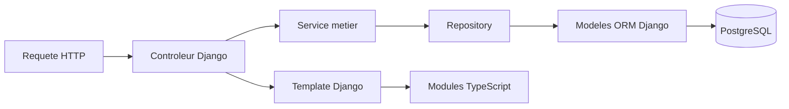

# Architecture et analyse d'AmbianceBoard

Etat observe le 2026-10-04. Cette documentation decrit le code existant,
pas une architecture cible. Les sources restent la reference en cas d'ecart.

## Vue d'ensemble

L'application permet d'organiser et de jouer des boutons audio, de publier des
soundboards et de partager une session de lecture. Le depot est un monorepo :

| Zone | Role | Point d'entree |
| --- | --- | --- |
| `app/` | Backend Django, HTTP, persistance, temps reel | [manage.py](../app/manage.py) |
| `frontend/` | Interactions TypeScript, audio, styles, bundles Vite | [package.json](../frontend/package.json) |
| `music-labeler/` | API FastAPI de classification audio | [main.py](../music-labeler/main.py) |
| `makeFileFolder/` | Commandes de developpement et tests | [Makefile](../Makefile) |
| `_procedure/` | Procedures d'exploitation | [Deploiement](../_procedure/DEPLOY-PROD.MD) |

## Backend : couches et dependances reelles

| Repertoire | Responsabilite actuelle |
| --- | --- |
| [interface](../app/main/interface/) | Controleurs/vues, formulaires et templates Django |
| [domain](../app/main/domain/) | Services metier, DTO, enums, exceptions, strategies et crons |
| [application](../app/main/application/) | Notamment integration d'authentification et adaptateurs de compte |
| [architecture](../app/main/architecture/) | Persistance ORM, repositories, migrations et integrations techniques |
| [parameters](../app/parameters/) | Configuration Django, URLs, ASGI et routage temps reel |
| [TNR](../app/main/TNR/) | Tests unitaires, integration et fixtures |

Un flux concret est l'affichage d'un soundboard :
`showSoundboardViews.py::soundboard_show` appelle `SoundBoardService` et
`SharedSoundboardService`, qui s'appuient sur les repositories et modeles.
La duplication d'une playlist passe notamment par `PlaylistDuplicationService`
pour les verifications de copiabilite, l'historique et la copie transactionnelle.

Cette organisation est inspiree de l'architecture hexagonale, mais n'est pas
une separation stricte des dependances : des services du domaine recoivent une
`HttpRequest`, utilisent Django et creent leurs repositories directement.
La couche `application` ne porte pas uniformement tous les cas d'usage.
Il ne faut donc pas deduire les dependances a partir du seul nom des dossiers.

## Modele metier

- **User** : identite, droits, tiers et quotas.
- **SoundBoard** : espace sonore d'un proprietaire, public/prive, avec
  personnalisation et tags.
- **SoundboardSection** : organisation des boutons dans un soundboard.
- **SoundboardPlaylist** : association d'une playlist a une section, avec
  ordre, raccourci et activation par les joueurs.
- **Playlist** : bouton/collection audio de type effet instantane, ambiance
  ou musique ; volume, delais, fondus et regles de copie.
- **Music / LinkMusic** : pistes issues d'un fichier ou d'un lien externe.

Les relations ont evolue vers les sections. Verifier les
[modeles actuels](../app/main/architecture/persistence/models/) avant de
modifier une requete : ne pas supposer une ancienne association directe
SoundBoard/Playlist. Toute evolution persistante demande une migration et
des tests d'integration adaptes.

## Frontend et temps reel

Les pages sont rendues par Django puis enrichies par des points d'entree
TypeScript. Ce n'est pas une SPA React. Les entrees et le build sont definis
dans [vite.config.ts](../frontend/vite.config.ts) ; les composants reutilisables
se trouvent dans [src/modules](../frontend/src/modules/) et les styles dans
[scss](../frontend/scss/).

Le moteur audio utilise notamment des adaptateurs et strategies de fondus.
Les interactions locales, l'etat de lecture et les messages de session
partagee doivent conserver des contrats compatibles entre maitre et joueurs.
Le temps reel repose sur Django Channels, Daphne et Redis ; son routage est
defini dans [routing.py](../app/parameters/routing.py).

En mode edition prive, les playlists communautaires proposent une liste de
pistes repliee par defaut. `SoundboardEditMode` initialise un groupe local de
`PlayerCustom` : chargement au clic, un seul son de preecoute a la fois, sans
fondu ni message WebSocket et sans modifier le mix du soundboard. Le repli,
le changement d'onglet, de filtre ou de page, la copie et la fermeture arretent
la preecoute ; les lecteurs sont detruits avant remplacement du contenu.
La route `soundboardEditModeCommunityTrackStream` exige une session authentifiee,
le droit sur le soundboard cible et une piste appartenant a une playlist
copiable non bannie. Elle reutilise le streaming des fichiers et liens
existants, sans exposer leur URL directe dans le template. Cette protection
ne rend pas prives les liens externes deja publics et ne modifie pas les
autres routes audio.

Les traductions Django sont conservees dans [locale](../app/locale/).
Preserver le mecanisme de traduction existant, y compris pour les templates,
messages et textes utilises par le frontend ; ne pas introduire un second
systeme i18n sans besoin explicite.

## Labellisation et infrastructure

Le [service music-labeler](../music-labeler/) expose une API FastAPI de
classification audio basee sur CLAP. Le backend lui transmet les pistes via
une integration HTTP ; des traitements asynchrones et crons participent a
l'orchestration. Distinguer transport HTTP, preparation audio et inference.
Les tests doivent isoler les integrations lourdes lorsque le comportement
verifie ne necessite pas un modele reel.

[docker-compose.yml](../docker-compose.yml) definit l'environnement local :
backend, frontend, serveur WebSocket, PostgreSQL, Redis, RabbitMQ, traitements
asynchrones, labeler, proxy et services auxiliaires. Le nom du service ne suffit
pas a identifier son executable : consulter sa commande et sa configuration.
[docker-compose.prod.yml](../docker-compose.prod.yml) decrit la production.
Les medias, donnees persistantes et sorties de build ne sont pas du code source.

## Analyse et principes d'evolution

Les separations controleurs/services/repositories, les strategies audio et les
tests par service offrent des points d'appui pour des changements localises.
Les zones de vigilance sont le couplage Django du domaine, l'instanciation
directe de dependances et la compatibilite des relations metier et messages
temps reel. Ce constat est une analyse structurelle, pas un audit exhaustif
de qualite, de securite ou de performance.

Appliquer SRP aux nouvelles modifications : ne pas melanger rendu HTTP,
regles metier, acces aux donnees et integrations externes dans une meme
responsabilite. Extraire seulement quand la separation est utile et testable.
Appliquer SOLID lorsque les variantes et contrats existent deja : reutiliser
les strategies, garder des interfaces petites et injecter les dependances
remplacables. Ne pas imposer de nouveaux use cases, interfaces ou conteneurs
d'injection a tout le depot pour obtenir une architecture ideale.

Voir [les consignes des agents](../AGENTS.md) et [la strategie de tests](TESTS.md).